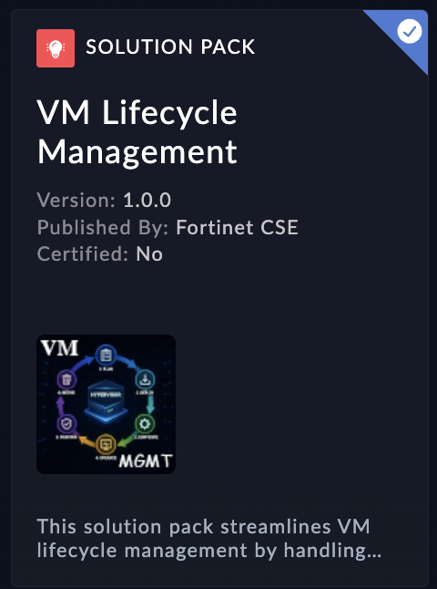

| [Home](../README.md) |
|--------------------------------------------|

# Installation

Install the Solution Pack. This is an example screenshot and what you see in the content hub may defer in version and details. 

 

# Configuration
 
- Install the solution pack and configure connectors mentioned over 
(contents.md link) 
- Be aware booting up all the machine may take few minutes
- Please verify and extra user *atlas* is added to FortiSOAR user, similar way you can add your own  uaser and assign required email id.
As far the current setup, this solution pack will use user *atlas* to submit request (requestor)
- setup *default_approver_email* variable to to email account that will approve the VM requests.
- Install and Configure a DNS connector setting it up with a public DNS of your choice (e.g. 1.1.1.1)
- *FortiGate Firewall Configurations*
 1. Open FortiGate GUI  with admin privilages
 2. Create an address group: Allowed_LAN_Devices if it doesn’t exist already
 3. Create an SNAT policy to allow traffic from Allowed_LAN_Devices to the internet if it doesn’t exist already
 4. Create a Web Filter Profile named *FortiSOAR* enabling URL Filter setting
 5. Create an Application Control Profile named *FortiSOAR* with default settings
 6. Create an API key with admin privileges
- *FortiGate Connector Configurations*
  Install and Configure a FortiGate connector with the following settings:
  Configuration Name: FortiGate
  Mark as default configuration
  host: `Your FortiGate IP`
  API Key: `Add the API Key you have just created`
  Port: `FortiGate API communication Port`
  Web Filter Profile Name: FortiSOAR
  Application Control Profile Name: FortiSOAR
  Verify SSL: False
 Save
- *SSH Connector*
 We will need this to run commands on the KVM host for provisioning and deprovisioning VMs.
 Install and configure SSH connector for KVM access
- *SMTP Connector*
Install and configure SMTP Connector
The default FortiMail config should allow relay from FortiSOAR IP, if it doesn’t please add it.
- *Code Snippet Connector*
 Enable Custom Code Execution in the System `Settings > System Configuration > Advance Development Features` checkbox , please do read the contents before enabling the checkbox.
- *IMAP Connector*
Configure your webmail for this configurations for e.g. FortiMail ( This should be your approver's email account)
- Enable data Ingestion and configure it
 1. Use Unified Communication : This will record emails in the communication module
 2. Save Mapping & Continue
 3. Schedule the connector to run every couple of minutes (to speed up test while you are developing the playbooks). Once the testing is done you can adjust the schedule as per your requirement.

*Fixing IMAP Data Ingestion*
Head to Automation > Data Ingestion and search for IMAP
  - Click on Playbooks and open IMAP > Ingest playbook
  - Open the Create Record step and set the subject to 
   {{vars.item.headers.Subject}} instead of 
   {{vars.item.headers.subject}}
  - Update Email From to 
   {{vars.item.headers.From}}
  - Update Email Recipients (To) To 
   {{vars.item.headers.To}}
  - Sender Domain: 
   {{(vars.item.headers.From.split('<')[-1] | replace(">","")).split('@')[-1] | replace(">","")}}
  - Sender Email Address: 
   {{vars.item.headers.From.split('<')[-1] | replace(">","")}}
  - Return Path: 
  {{ vars.item.headers['Return-Path'] }}
  - Source ID: 
  {{ vars.item.headers['Message-ID'] | join }}
  -  Name: 
   {{vars.item.headers.Subject}}  Email from {{vars.item.headers.From}} 
  - Save and quit the playbook editor
Test with another Dummy email for e.g. atlas@fortielab.com -> fortisoar@fortielab.com to make sure emails are being ingested and parsed properly

- *Enable Custom Connectors Upload*
Enable Custom Code Execution in the System `Settings > System Configuration > Advance Development Features` checkbox , please do read the contents before enabling the checkbox. This will enable custom connector upload.

- Install and configure *Google Gemini Connector*
- Install *Playbook Buttons* widget from Content hub.

| [Usage](./usage.md) | [Contents](./contents.md) |
|---------------------|---------------------------|
