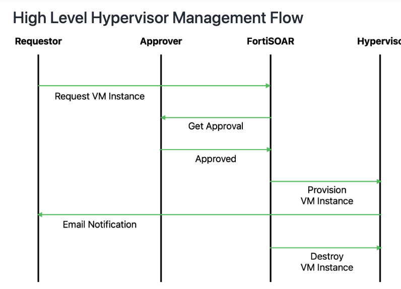
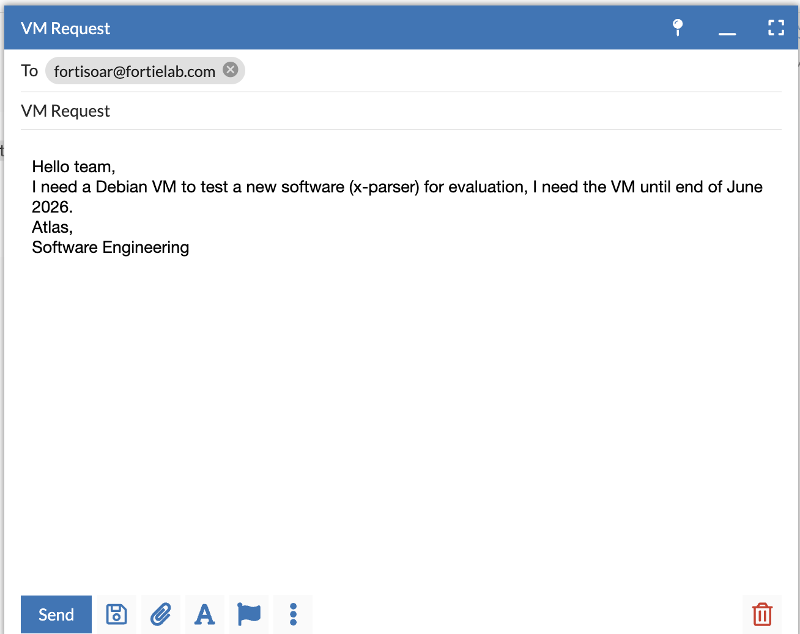
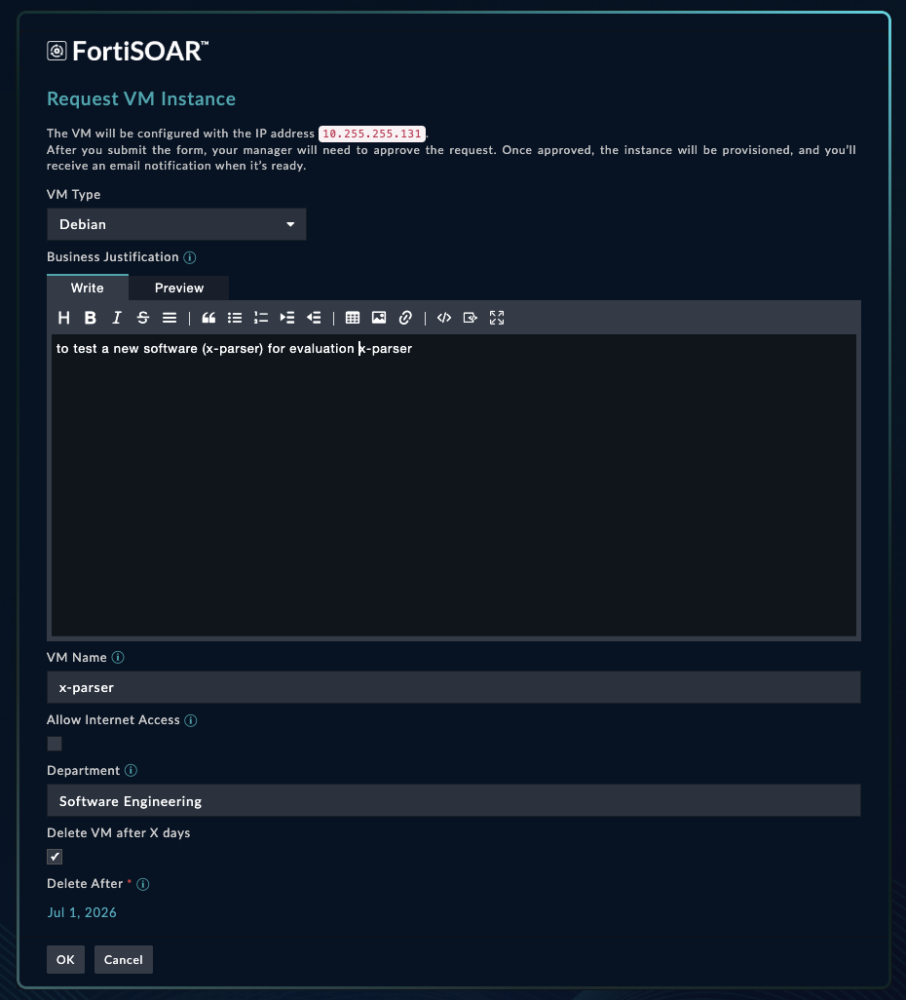
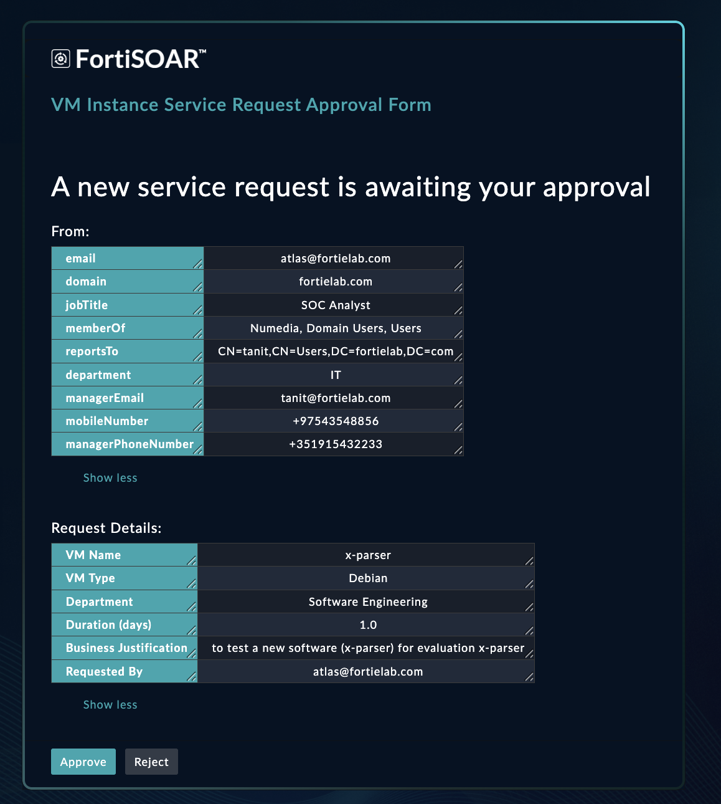
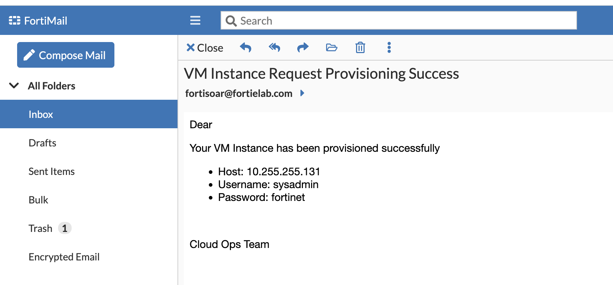
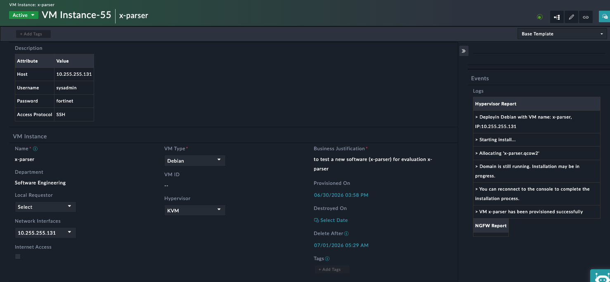
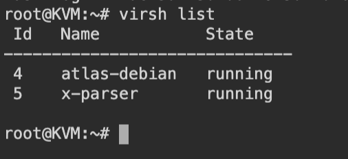
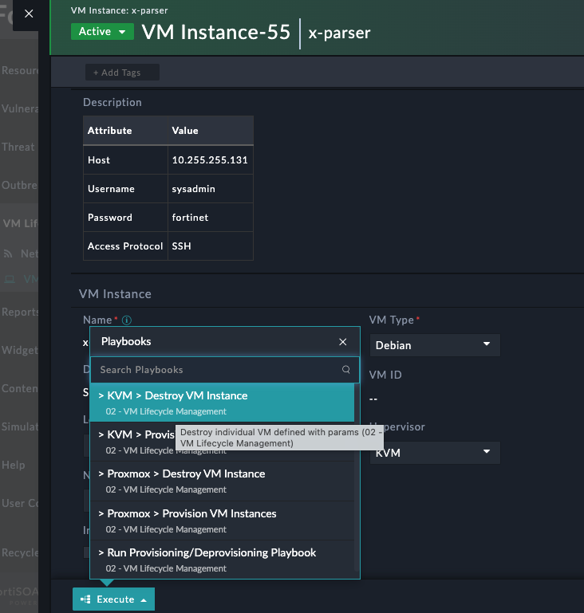
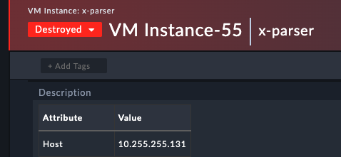

| [Home](../README.md) |
|--------------------------------------------|

# Usage

The **VM Lifecycle Management** Solution Pack automates the provisioning, management, and decommissioning of virtual machines (VMs) on supported hypervisors, such as **Proxmox** and **KVM**, using FortiSOAR. It streamlines VM lifecycle operations by combining automated request processing, approval workflows, provisioning, and deprovisioning into a single solution.

## Objectives
The solution pack provides the following capabilities.

### VM Provisioning

FortiSOAR handles new virtual machines deployment requests on supported hypervisors, such as Debian.

1. FortiSOAR accepts VM provisioning requests through:
    - Email, where Google Gemini/FortiAI extracts request details and pre-populates the request form with default values.
    - A request form in the FortiSOAR user interface.
3. Routes requests to the requestor's manager or the Cloud Operations team for approval.
4. Once approved, the created VM and its attributes are stored in FortiSOAR as a **VM Instance** record.
    - Optionally, internet access can be configured internet access through FortiGate Firewall integration.

### VM Decommissioning

- FortiSOAR handles decommissioning of VMs when they reach their expiration date. Users can also  destroy VM instances on demand.
- Once decommissioned: 
  - Status of the corresponding **VM Instance** record is set to **Destroyed**
  - Release the associated IP address
  - Remove related firewall configuration

## Request a VM Instance

The following workflow describes how a VM provisioning request is processed.

1. When an email request is received through IMAP, the **Parse VM Requests Emails** playbook is triggered and a **VM Instance** record is created in FortiSOAR.

2. The **Parse VM Requests Emails** playbook using Google Gemini extracts key request attributes from  the email.

3. The extracted requests attributes are provided to the **Request VM Instance** playbook, which then creates a **Network Interface** record for the VM and generates a pre-populated request form for the requestor to complete.
   

4. After the **VM Instance** record is created, the **Manage VM Instance Request** playbook is triggered to:
   - Validate the requestor against Active Directory.
   - Identify the requestor's manager.
   - Send an approval request to the manager or the Cloud Operations team.
   

5. After the request is approved, the **> Run Provisioning/Deprovisioning Playbook** is triggered to
   - Evaluate available resources across configured hypervisors.
   - Selects the most appropriate hypervisor.
   - Dynamically invokes the corresponding provisioning playbook. For example, if KVM is selected, the **KVM > Provision VM Instances** playbook is executed.

6. The selected provisioning playbook creates the VM by using the SSH connector to execute commands on the target hypervisor.

7. After provisioning completes successfully:
   - The requestor receives an email notification.
   - A **VM Instance** record is updated in FortiSOAR.  
   

8. Verify the deployed VM:
   - In the FortiSOAR **VM Instance** record.
     
   - On the target hypervisor, KVM in our example:
     

## Destroy a VM Instance

To decommission a VM instance:

1. Open the VM Instance record in FortiSOAR.

2. Run the appropriate destroy playbook for the target hypervisor. For example, to decommission a VM on KVM, run the **KVM > Destroy VM Instance** playbook. 

3. The playbook uses the SSH connector to destroy the VM on the hypervisor.

4. After the VM is successfully decommissioned:
   - The **VM Instance** record status is updated to **Destroyed**.
   - Any internet access configured through FortiGate is removed during Post Destruction Cleanup activities.
   - The linked **Network Interface** record is deleted.
   

